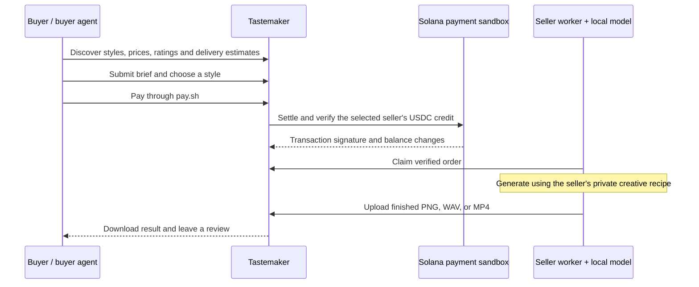

# Tastemaker

**Agents don’t just buy compute — they buy taste.**

A creative marketplace built for the **Solana Agent Hackathon**. Buyers and their agents purchase a seller’s signature image, music, or video style: the creative recipe, the generation, and the finished result.

A seller brings a model and a point of view. A buyer brings a brief and a budget. Tastemaker connects them through discoverable listings, seller-set prices, order reviews, and verified sandbox USDC payments.

## The demo

> “Make a luxury skincare ad and a minimal piano soundtrack. Find a seller within my budget, pay them, and save the results on my laptop.”

The image and soundtrack are separate orders. Each follows the same flow:



**What you can try:**

- Browse image, music, and video styles by vibe, price, and seller. Examples include Luxury Product Ad, Streetwear Hype, Luxury Ambient Music, and Luxury Product Film.
- Choose a style yourself or use the built-in picker, which considers budget, matching tags, ratings, delivery time, and price.
- Watch a separate seller process receive an order and generate on its own machine. Sellers set their own prices and can publish multiple styles.
- Inspect the settlement signature and actual buyer/seller USDC changes before generation starts.
- Download an image, play a music track or video, and leave a review. Compare sellers’ overall ratings and comments across their styles.

## Try it locally

Requires **Node.js 22.13+** and npm. No API key, wallet, model installation, or external database is needed for this first walkthrough.

```sh
npm install
npm run dev
```

Open **http://localhost:3000**. SQLite and demo listings are created automatically; `npm run seed` is also safe to run without resetting existing orders.

1. Open a style and select **Use this style**, or start **Create something**.
2. Choose Image, Music, or Video, enter a brief and budget, then select a style or **Auto-pick for me**.
3. Confirm simulated checkout and watch **queued → generating → delivered**.
4. Download the PNG, or play/download the WAV or MP4. Rate the delivered order.
5. Visit **Sellers** to compare prices and reviews, or **Seller studio** to publish a listing.

This default walkthrough uses simulated payment and clearly labeled demo output: composed image posters, synthesized audio, and a slow-pan slideshow video (demo video needs `ffmpeg` on `PATH`, or `FFMPEG_PATH`). Music and video styles specify a fixed clip duration of 5–30 seconds; the listed price covers one clip.

## Demo a seller getting paid

Install the [Pay CLI](https://pay.sh/docs/get-started) for sandbox checkout, then run these in separate terminals:

```sh
# Marketplace: http://localhost:3001
npm run buyer
```

```sh
# Seller dashboard: http://localhost:4001
npm run seller
```

The default seller is `@studio.aure`, with image, music, and video listings. The worker claims orders automatically and must remain running to deliver. Pause and resume it from the dashboard to demonstrate the handoff. On another seller laptop, set `MARKETPLACE_URL` in `.env.worker` to the marketplace’s reachable address; no shared disk is required.

The worker automatically detects these optional local model wrappers:

| Output | Default wrapper                            | Script arguments                                                   |
| ------ | ------------------------------------------ | ------------------------------------------------------------------ |
| Image  | `~/Pictures/local-image-gen/generate.sh`   | `--prompt`, `--steps`, `--seed`, `--width`, `--height`, `--output` |
| Music  | `~/Pictures/local-image-gen/music.sh`      | `--prompt`, `--duration`, `--output`                               |
| Video  | `~/Pictures/local-image-gen/demo-video.sh` | `--config`, `--output`                                             |

**Video** is an edited product film, not a video diffusion model. The worker generates 4 scenes with the image wrapper (same private recipe, varied shot directions, consecutive seeds), generates a soundtrack of the listing's duration with the music wrapper, and then renders an H.264/AAC MP4 with Remotion via `demo-video.sh`. A seller recipe may put its music direction after `Soundtrack:`. That part goes only to the music model, and the rest goes to the image model. Headlines are templated from the buyer's brand name and the first sentence of the brief. The private recipe never appears on screen. Scenes, music, the props JSON, and the renderer's metadata sidecar are generated in a temporary folder and deleted after delivery. Local video requires the image wrapper. Without the music wrapper, it uses the demo synthesizer for the soundtrack. A 15-second, 4-scene film took about 90 seconds on this Mac. Optional settings are `SELLER_VIDEO_GENERATOR`, `LOCAL_VIDEO_SCRIPT`, `LOCAL_VIDEO_SLIDES`, `LOCAL_VIDEO_WIDTH`/`HEIGHT`, and `LOCAL_VIDEO_TIMEOUT_MS`. Uploads are validated as MP4 with a video track, the purchased duration (±0.25s), and a size limit of 64 MB.

Models and their dependencies are installed separately. Without a wrapper, that medium uses labeled mock output. A configured model failure is shown as a failed order with a retry action. See [.env.worker.example](.env.worker.example) for script paths and seller settings, and [.env.example](.env.example) for optional single-server OpenAI image generation.

**Sandbox payment is an actual test-USDC transaction.** The marketplace checks the accepted Pay receipt against the settlement transaction: successful execution, the selected seller’s payout address, and the exact USDC amount. It displays the signature and balance changes from transaction metadata. Seller generation is gated on verification.

This uses Pay’s hosted Surfpool **sandbox/localnet**, not Solana public devnet/testnet or mainnet. Tokens have no monetary value. In the browser, checkout provides a `pay --sandbox` command to run in your terminal; the page then updates automatically. There is no in-browser wallet signing yet. [Pay network documentation](https://pay.sh/docs/pay-for-apis/sandbox-and-networks).

For the same separate-worker demo with offline checkout, start the buyer with `PAYMENT_MODE=simulated npm run buyer`.

## Let your agent buy a creation

With the buyer and seller running, try the reference client:

```sh
npm run agent -- "A luxury skincare bottle in soft morning light" --budget 5 --open

npm run agent -- "Minimal luxury ambient music, warm piano, no vocals" --type music --budget 5 --timeout 900 --open

npm run agent -- "A launch film for a botanical skincare serum, morning light" --type video --brand AURA --budget 5 --timeout 900 --open
```

The client discovers styles, pays through the installed Pay CLI when required, waits for the seller, and saves the result to `agent-output/`. It is a deterministic HTTP reference client; an external agent can make its own choices using the same API.

For a local Claude session with Pay configured for sandbox, give it this instruction:

> Read http://localhost:3001/agent-guide.md. Find a music style for minimal luxury ambient music with warm piano and no vocals, within 5 test USDC. Submit the order, pay using sandbox, and download the WAV to my laptop.

The [agent integration guide](public/agent-guide.md) documents discovery, orders, payment, downloads, retries, and user-requested reviews. Start with `GET /api/agent` for the machine-readable contract. An agent running remotely can return a download link; saving a file on its server does not save it on the buyer’s laptop.

To resume a saved order after a timeout:

```sh
npm run agent -- --job JOB_ID --open
```

## Built with

**Next.js App Router · TypeScript · Tailwind CSS · SQLite · Solana Pay Kit (MPP)**

The marketplace persists listings, orders, reviews, and payment evidence. Independent seller workers poll over HTTP, run private creative recipes through local generators, and upload results. Public listing and buyer APIs omit private workflow prompts. The same seller payout and review system serves images, music, and video.

## Verification

```sh
npm run typecheck
npm run lint
npm test
npx playwright install chromium
npm run test:e2e
npm run test:worker
npm run build
```

The suites cover marketplace checkout, seller publishing, ratings, payment verification, retries, worker handoff, and PNG/WAV/MP4 delivery. Standard tests use fixtures and simulated payments; run the browser suites sequentially.

With Pay installed, test actual hosted sandbox settlement:

```sh
TEST_PAY_SANDBOX=1 npm run test:worker
```

To render a real local video through isolated buyer/seller servers with simulated checkout, run `TEST_LOCAL_VIDEO=1 npm run test:worker -- --grep "purchases video"`.

Local image, music, and video model delivery have also been exercised through separate seller processes and buyer-agent downloads. Model wrappers are optional and are not bundled with this repository.

## MVP scope

- This documented demo covers text-to-image, text-to-music, and text-to-video (an edited film of generated scenes). Reference-input workflows are not included.
- Payments are sandbox or simulated. Mainnet, refunds, production reconciliation, and browser wallet signing are outside this MVP.
- This is a shared demo without buyer/seller sign-in. Reviews are limited to one per delivered order, but are not tied to authenticated buyer identities. Seller credentials shipped as demo defaults must be replaced for a deployment.
- SQLite and generated files require persistent local storage. An offline seller leaves orders queued; configuration is not a guarantee of live availability.

## Preview credits

Bundled photographs are illustrative style previews and cover artwork, not outputs from the live generators. Sources: [perfume](https://images.unsplash.com/photo-1541643600914-78b084683601), [sneaker](https://images.unsplash.com/photo-1542291026-7eec264c27ff), [skincare](https://images.unsplash.com/photo-1608571423902-eed4a5ad8108), [headphones](https://images.unsplash.com/photo-1505740420928-5e560c06d30e), [cat](https://images.unsplash.com/photo-1514888286974-6c03e2ca1dba), and [botanical](https://images.unsplash.com/photo-1416879595882-3373a0480b5b) photography via Unsplash. The included transparent AURA bottle is original procedural artwork.
