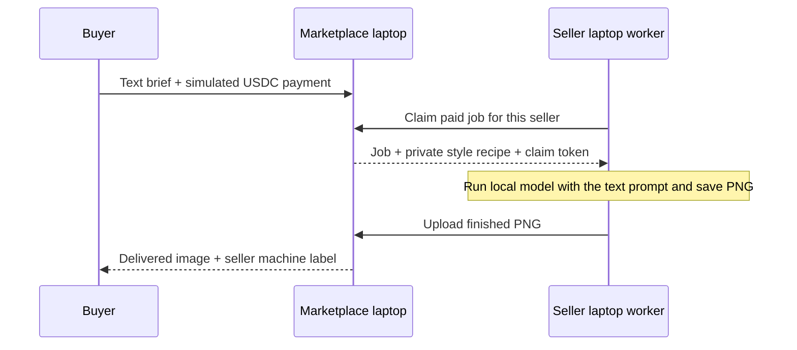

# Tastemaker

**Agents don’t just buy compute — they buy taste.**

A hackathon MVP marketplace for independent image-generation styles. Sellers package a creative recipe; buyers describe an image in a brief, choose a style (or let a buyer agent choose), pay simulated USDC, and receive a downloadable image.

Built with Next.js App Router, TypeScript, Tailwind CSS, SQLite, and Sharp. No authentication, wallet, API key, or external database is needed for the default demo.

## Run locally

Requires **Node.js 22.13+** (Node 24 LTS recommended) and npm. SQLite uses Node’s built-in `node:sqlite` module; no database installation or Prisma generation is required. Some Node versions print an experimental SQLite warning.

```sh
npm install
npm run seed
npm run dev
```

Open **http://localhost:3000**. Seeding is also automatic on the first database access, so `npm run seed` is optional and safe to repeat. It preserves existing listings and jobs. Six demo listings, five sellers, local sample photographs, and a transparent sample product are included.

Production preview:

```sh
npm run build
npm start
```

## Demo walkthrough

1. Explore the marketplace; filter by vibe, search a creator, or sort by price and delivery time.
2. Open **Luxury Product Ad** and click **Use this style**, or start **Create an image**.
3. Describe your subject and scene. No input image is needed; new orders are text-to-image.
4. Enter `A quiet luxury launch for a botanical skincare serum.`, brand `AURA skincare`, budget `5`, and vibes `luxury` and `minimal`.
5. Click **Find my style**, then **Auto-pick for me**. The buyer agent selects Luxury Product Ad at **2.50 USDC** and explains its decision. You can also select a style manually.
6. Review the order and click **Pay 2.50 USDC & create**. Payment visibly progresses from pending to confirmed. No real funds move.
7. Watch **queued → generating → delivered**. Local mock delivery takes roughly 7–10 seconds; listing ETAs represent the intended creative service and live API latency varies.
8. Compare the brief, selected style, and output. Download the PNG or create another image.
9. Visit **Seller studio** to publish a new style, upload 1–3 examples, choose pricing and a fallback palette, and enter a private workflow prompt.

Saved creations appear in **My creations**, including pending payments and interrupted work. Reloading a job resumes progress; failed jobs can be retried without another payment.

## Seller laptop demo

The marketplace can hand orders to a **separate seller worker over HTTP**. The worker receives the text brief and its seller’s private style recipe, generates a PNG on its own machine, saves a local copy, and uploads the result. It has no access to the marketplace database or filesystem. The seller can run a **real local AI model** or the mock compositor. Payment remains simulated.

### Quick demo on one laptop

No environment setup is needed. Run these from the project folder in two terminals:

```sh
# Terminal 1 — buyer marketplace at http://localhost:3001
npm run buyer
```

```sh
# Terminal 2 — seller dashboard at http://localhost:4001
npm run seller
```

The seller handle, matching demo token, and ports have built-in defaults. `npm run buyer` starts the worker-mode marketplace and reads optional overrides from `.env.local`. `npm run seller` reads optional overrides from `.env.worker` and automatically uses `~/Pictures/local-image-gen/generate.sh` when executable. Otherwise it uses the mock compositor. No copying files or entering credentials is required on this laptop.

Or start both processes with one command:

```sh
npm run demo:distributed
```

The combined launcher starts two independent processes with a fresh in-memory seller token:

- **Buyer marketplace:** http://localhost:3001
- **Seller machine dashboard:** http://localhost:4001

Open both windows. The default worker serves `@studio.aure`, which owns **Luxury Product Ad** and **Botanical Editorial**. Worker-mode creation and auto-picking offer only sellers configured on the marketplace; other styles remain browsable.

For the clearest demo:

1. On the seller dashboard, click **Pause worker** before creating an order.
2. In the marketplace, buy **Luxury Product Ad** with a short text brief.
3. The buyer sees **Waiting for @studio.aure’s laptop**. The marketplace never generates this image itself.
4. Click **Resume worker** on the seller dashboard. Watch **Preparing text prompt → Generating with local AI → Uploading result** (or mock composition when no script is available).
5. The buyer sees **Generated on Studio Auré · Seller laptop**, with the downloadable result. The seller also sees the image and activity log.

Pausing stops new claims; an already claimed job finishes. The worker keeps polling independently of the buyer page, so you can close the buyer tab and return to the delivered result. `Ctrl+C` stops both demo processes. To use different ports: `DEMO_PORT=3003 WORKER_PORT=4003 npm run demo:distributed`.

### Sell with your local generator

On this laptop, `npm run seller` automatically finds:

```text
/Users/hangxie/Pictures/local-image-gen/generate.sh
```

It runs your existing Flux.2 Klein / MLX setup with `--steps 4 --seed 42 --width 768 --height 768`. Keep the T7 drive mounted, since your script stores its model cache there. The worker overrides `--output` with a unique temporary PNG path, removes prompt metadata, saves the finished image under `worker-data/`, and uploads it. The private recipe and buyer brief are passed together as a literal `--prompt` argument, without a shell. The worker processes one job at a time, renews its lease during generation, and stops a model process on shutdown or timeout (default three minutes).

To participate: publish a style under `studio.aure` in **Seller studio**, set its price and private art direction, then leave `npm run seller` running while accepting orders. Buyers can choose any of that seller’s listings. No one needs to manually run `generate.sh` per order. If your laptop is asleep, disconnected, or the worker is stopped, orders wait. For continuous availability, run the worker and model on an always-on machine. This MVP records simulated sales; it does not transfer earnings.

An optional `.env.worker` can change the script or defaults (see `.env.worker.example`). `SELLER_GENERATOR=local` requires a working script; `SELLER_GENERATOR=mock npm run seller` forces the demo compositor. Auto mode falls back only when no script is installed. A script that fails—for example because T7 is unmounted—marks the job failed for retry and **never silently substitutes a mock**. The dashboard and delivered job clearly label the renderer.

New orders support **text-to-image only**. Existing image-input jobs remain readable; the mock and OpenAI providers retain compatibility, but the local script worker rejects those old jobs. Reference-image conditioning can be added later when the script supports it.

### Run on two actual laptops

Both machines need this repository, Node.js 22.13+, and `npm install`. No shared disk is needed.

**Buyer laptop:**

```sh
npm run buyer
```

**Seller laptop:** create `.env.worker` with just the buyer laptop’s address:

```dotenv
MARKETPLACE_URL=http://MARKETPLACE_LAN_IP:3001
```

```sh
npm run seller
```

Open **http://localhost:4001 on the seller laptop**. The dashboard binds to loopback; only the marketplace needs to be reachable across the network. Both machines must be able to reach the marketplace LAN address and port; permit that port through the marketplace machine’s firewall if needed. Use HTTPS when crossing an untrusted network, since seller credentials are bearer tokens.

All other values match automatically using the shared demo defaults. `.env.worker.example` lists optional overrides. `npm run worker` remains an alias for the seller process. `.env.worker` and `.env.local` are ignored by Git. PNGs are saved in the worker’s ignored `worker-data/` folder. Optional worker settings: `WORKER_OUTPUT_DIR` changes that folder; `WORKER_DEMO_DELAY_MS` controls the visible composition delay (default 6000 ms, maximum 120000 ms).

For custom seller credentials, set `SELLER_WORKER_TOKENS` (a JSON handle/token map) in the buyer’s `.env.local`, and matching `SELLER_HANDLE` and `SELLER_WORKER_TOKEN` in the seller’s `.env.worker`. Custom tokens must have at least 16 characters. Restart both processes after changing their environment. Newly created seller handles must be configured before their styles can accept worker-mode orders. The built-in credential is public demo data; worker names are display labels, not hardware identity attestations.

### Handoff and recovery



Claims are seller-scoped and atomic. Workers renew a 60-second lease every 10 seconds. If a worker disappears, another worker for the same seller can reclaim the order after the lease expires. Old claim tokens cannot overwrite a newer result. Completion is idempotent, and worker failures can be retried without another simulated payment. With no worker online, an order waits instead of falling back to marketplace generation. The authenticated worker receives only its own seller’s private workflow via the claim endpoint. It combines that recipe with the brief for local AI generation. Public listing and job endpoints never expose recipes. Mock mode uses the style palette rather than interpreting the recipe.

Execution mode is saved on each order. Existing local-mode jobs keep their local behavior when the server switches to worker mode. Return to the original single-server flow with `EXECUTION_MODE=local` or by unsetting it and running `npm run dev`.

## Environment variables

No `.env` file is required. To configure live generation, copy `.env.example` to `.env.local` and restart the server.

| Variable             | Default           | Purpose                                                                                                                                                                          |
| -------------------- | ----------------- | -------------------------------------------------------------------------------------------------------------------------------------------------------------------------------- |
| `GENERATION_MODE`    | `auto` when unset | `mock` always uses the local compositor; `auto` uses OpenAI when a key is present; `openai` explicitly requires the key. The example file selects `mock` for a predictable demo. |
| `OPENAI_API_KEY`     | empty             | Server-side key for optional OpenAI image generation. Never exposed to the browser.                                                                                              |
| `OPENAI_IMAGE_MODEL` | `gpt-image-1`     | Image model used by the OpenAI provider.                                                                                                                                         |
| `DATA_DIR`           | `./data`          | Writable folder for SQLite and uploaded/generated PNGs. Relative paths resolve from the project root.                                                                            |

### Mock mode

`EXECUTION_MODE=local` (the default) runs generation in the marketplace process. `EXECUTION_MODE=worker` dispatches new jobs to configured sellers; `SELLER_WORKER_TOKENS` is the private JSON map of seller handles to worker bearer tokens. See the seller laptop demo above for configuration.

In single-server mock mode, or when the seller worker has no local generator, the app creates a **1024 × 1280 abstract PNG poster** using the brand name, brief, and chosen style’s palette. This is a deterministic composition, not an AI-generated depiction of the subject. Six palettes provide different treatments. Arbitrary hidden prompts are interpreted by real generators only.

The UI labels demo payments and locally composed results. All default images are checked into `public/samples/`; the demo makes no external image requests.

### Live generation

```dotenv
GENERATION_MODE=auto
OPENAI_API_KEY=your-key
OPENAI_IMAGE_MODEL=gpt-image-1
```

In single-server mode, the server sends the seller’s private workflow, buyer brief, and optional brand name to the [OpenAI Image API generation endpoint](https://developers.openai.com/api/docs/guides/image-generation). The returned PNG is stored locally. Requires API credits and access to the configured model; provider charges are separate from the simulated marketplace price.

Real provider errors are displayed as failed jobs with a retry action; the app does **not** silently substitute mock output after a live failure. Requests time out after 150 seconds. No paid API requests are made by automated tests. The optional local-model integration check described below runs your installed script.

## How it works

```text
src/app/                 App Router pages and API routes
src/components/          Marketplace, creation flow, seller form, job status UI
src/lib/types.ts         Seller, StyleListing, GenerationJob, MediaType
src/lib/db.ts            SQLite tables, idempotent seed, public projections
src/lib/seed.ts          Six signature style listings
src/lib/agent.ts         Budget filter → exact tag matches → lowest ETA → price
src/lib/generation.ts    ImageProvider interface, mock and OpenAI providers
src/lib/mock-image.ts    Portable PNG compositor shared by local and seller execution
src/lib/workers.ts       Seller authentication, atomic claims, leases, and completion
src/lib/media.ts         Image validation, normalization, local storage
src/lib/validation.ts    API input validation
scripts/seed.ts          Optional explicit seed command
scripts/seller-worker.ts Independent seller process and local dashboard server
scripts/local-generator.ts Safe CLI adapter for a local text-to-image model
scripts/distributed-demo.ts One-command marketplace + seller worker demo
tests/                  Agent unit tests and Playwright acceptance tests
```

SQLite stores `Seller`, `StyleListing`, and `GenerationJob` records as JSON in relational tables with stable primary keys and foreign keys. Prices are snapshotted on jobs and validated on the server. Seller handles group multiple styles under the same seller.

Private workflow prompts are stored in the server database and shared only with the generation provider or the authenticated worker assigned to that seller. Public API responses, server-rendered listing data, agent selections, and job metadata use an explicit public projection that removes `hiddenWorkflowPrompt`.

In local mode, the browser polls job state and advances paid work through a small HTTP state machine. A SQLite compare-and-swap claim prevents duplicate provider calls from multiple tabs. Delivered jobs and payment confirmations are idempotent. If the local process stops during generation, the job becomes retryable after a three-minute stale-claim timeout. A local queued job advances when its page is open. In worker mode, the independent seller process drives generation and the browser only observes status; a separate SQLite table stores private claim tokens and leases. Neither mode needs an external queue service.

## Checks

```sh
npm run typecheck
npm run lint
npm test
npx playwright install chromium
npm run test:e2e
npm run test:worker
npm run build
```

Browser tests start their own server on port 3100 with an isolated database under `data/test-*`. They cover browsing, filtering, detail pages, text-only ordering, seller sample upload, auto-picking, manual selection, mock payment, refresh recovery, download, seller publishing, private-prompt isolation, invalid requests, and mobile overflow. Screenshots are saved under `test-results/`.

The worker browser test uses marketplace port 3102 and seller dashboard port 4102. It starts the actual seller process in an isolated temporary directory, verifies that orders wait without a worker, exercises pause/resume, and checks local output and HTTP delivery. Unit tests also cover seller credential isolation, unpaid/local-job exclusion, stale lease recovery, and idempotent completion. Test servers use an isolated `.next/testing` build so your running marketplace is left alone. Run the two browser suites sequentially; they share that test build directory.

For an actual local-model delivery test (requires the installed generator and mounted model cache):

```sh
TEST_LOCAL_GENERATOR=1 npm run test:worker
```

This generates one real image, verifies delivery through the buyer UI, and saves `test-results/local-ai-delivery.png`. Regular tests force mock mode for predictable speed. All test servers shut down afterward.

## Deliberate MVP boundaries

- **Payments are simulated.** There are no on-chain transactions, wallet connections, settlement, or real balances. The app is Solana/USDC themed, not an on-chain marketplace.
- **No sign-in.** Seller handles, creations, uploads, and job URLs are shared by users of the local instance. Workflow prompts are omitted from public routes, but this is not a secure multi-tenant service.
- **Persistent local disk is required.** Use a long-running Node process with writable storage. Ephemeral serverless filesystems require a different database, object storage, and a durable worker.
- Uploads are limited to 10 MB and PNG/JPG/WebP; decoded images are capped at 40 million pixels and normalized to PNG with a maximum dimension of 1600 pixels.
- Commercial use is a seller-provided listing label. Buyers remain responsible for the rights to their inputs and final uses.

## Extending to video

`MediaType` already allows `image | video`. The current picker and checkout only accept image listings. Add a video provider with an asynchronous submit/status interface, duration/aspect-ratio inputs, object storage for larger files, and a video player on the delivery page. Reuse sellers, style recipes, pricing, payment state, and the overall job flow. A real Solana USDC payment adapter and worker queue can replace the mock payment and browser-driven generation independently.

## Preview image credits

Sample photography is bundled from Unsplash for the demo; editorial text and layout are rendered by the application. These are illustrative style previews, not examples generated by the live provider.

- [Perfume photograph](https://images.unsplash.com/photo-1541643600914-78b084683601) — source ID `photo-1541643600914-78b084683601`
- [Sneaker photograph](https://images.unsplash.com/photo-1542291026-7eec264c27ff) — source ID `photo-1542291026-7eec264c27ff`
- [Skincare photograph](https://images.unsplash.com/photo-1608571423902-eed4a5ad8108) — source ID `photo-1608571423902-eed4a5ad8108`
- [Headphones photograph](https://images.unsplash.com/photo-1505740420928-5e560c06d30e) — source ID `photo-1505740420928-5e560c06d30e`
- [Cat photograph](https://images.unsplash.com/photo-1514888286974-6c03e2ca1dba) — source ID `photo-1514888286974-6c03e2ca1dba`
- [Botanical photograph](https://images.unsplash.com/photo-1416879595882-3373a0480b5b) — source ID `photo-1416879595882-3373a0480b5b`

The transparent AURA sample bottle is original procedural artwork included with the project.
