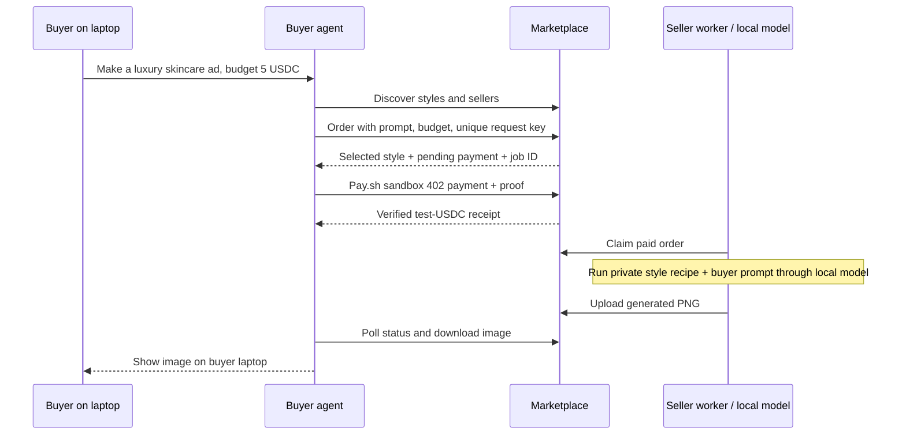
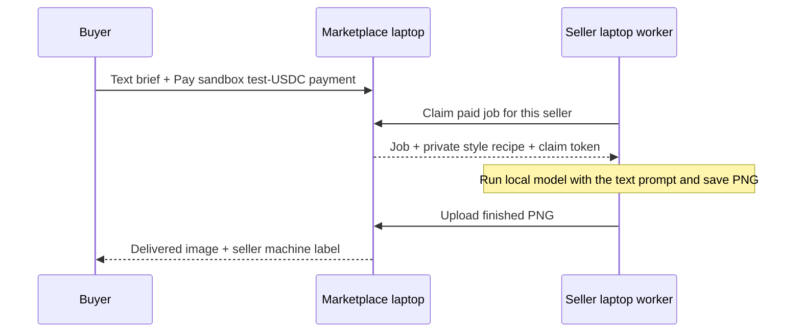

# Tastemaker

**Agents don’t just buy compute — they buy taste.**

A hackathon MVP marketplace for independent image-generation styles. Sellers package a creative recipe; buyers describe an image in a brief, choose a style (or let a buyer agent choose), pay through pay.sh sandbox (or simulated checkout), and receive a downloadable image.

Built with Next.js App Router, TypeScript, Tailwind CSS, SQLite, and Sharp. No authentication, wallet, API key, or external database is needed for the default demo.

## Run locally

Requires **Node.js 22.13+** (Node 24 LTS recommended) and npm. SQLite uses Node’s built-in `node:sqlite` module; no database installation or Prisma generation is required. Some Node versions print an experimental SQLite warning.

```sh
npm install
npm run seed
npm run dev
```

Open **http://localhost:3000**. Seeding is also automatic on the first database access, so `npm run seed` is optional and safe to repeat. It preserves existing listings and jobs. Six demo listings, five sellers, local sample photographs, and a transparent sample product are included.

Production preview:

```sh
npm run build
npm start
```

## Single-server simulated demo walkthrough

1. Explore the marketplace; filter by vibe, search a creator, or sort by price and delivery time.
2. Open **Luxury Product Ad** and click **Use this style**, or start **Create an image**.
3. Describe your subject and scene. No input image is needed; new orders are text-to-image.
4. Enter `A quiet luxury launch for a botanical skincare serum.`, brand `AURA skincare`, budget `5`, and vibes `luxury` and `minimal`.
5. Click **Find my style**, then **Auto-pick for me**. The buyer agent selects Luxury Product Ad at **2.50 USDC** and explains its decision. You can also select a style manually.
6. Review the order and click **Pay 2.50 USDC & create**. Payment visibly progresses from pending to confirmed. No real funds move.
7. Watch **queued → generating → delivered**. Local mock delivery takes roughly 7–10 seconds; listing ETAs represent the intended creative service and live API latency varies.
8. Compare the brief, selected style, and output. Download the PNG or create another image.
9. Visit **Seller studio** to publish a new style, upload 1–3 examples, choose pricing and a fallback palette, and enter a private workflow prompt.
10. On a delivered order, choose 1–5 stars and optionally write a short review. Submit once; the style and seller ratings update for the next buyer.

Saved creations appear in **My creations**, including pending payments and interrupted work. Reloading a job resumes progress; failed jobs can be retried without another payment.

## Ratings and reviews

Open **Sellers** in the navigation, or `/sellers`, to compare every listed seller's overall rating, review count, USDC price range, and individual style prices. Each style links to its detail page. The directory includes sellers who are not configured for ordering; worker mode labels these as browse-only. Ordering eligibility does not imply the seller is currently online.

Click **View reviews** for a seller to read feedback across all their styles at `/sellers/{sellerId}`. Each review shows its style link, stars, optional comment, and date. Reviews are newest first, with 20 per page and navigation to older feedback. Rating-only entries are labeled explicitly. Style detail pages also link to **All seller reviews**.

Reviews come only from **delivered orders**: one immutable review per order, integer 1–5 stars, and optional text up to 280 characters. Identical retries return the original review; an attempt to change it returns 409. The unique order constraint and write transaction prevent concurrent submissions from double-counting. No ratings are seeded or fabricated. A fresh style has `averageRating: null` and `reviewCount: 0`.

Marketplace cards, style details, and the buyer's style selection show raw average ratings and review counts. Style details also show the seller's aggregate across every reviewed order for all of their styles, and the latest 20 reviews. Seller averages are weighted by orders, not by averaging each style's average.

The built-in picker first excludes styles over budget, then sorts by tag overlap, then a rating score that tempers small samples, then ETA and price:

```text
ratingScore = (averageRating * reviewCount + 3 * 10) / (reviewCount + 10)
```

The 3-star, 10-observation prior is only ranking math; it is never stored as reviews or displayed as a rating. An unrated style has a neutral score of 3. For equally matching styles within budget, 4.8 stars from 30 reviews scores 4.35; 5.0 from one review scores about 3.18. External agents receive the unadjusted `averageRating` and `reviewCount` on both the style and `seller`, so they can make their own judgment.

`POST /api/jobs/{jobId}/review` accepts `{ "stars": 5, "text": "Beautiful light." }` after delivery. `GET` on the same URL returns the saved review or null. `GET /api/styles/{styleId}/reviews` returns the latest 20 public reviews and aggregate values. Agent order status exposes `review` and an available `reviewUrl`; agents should only submit feedback supplied by their user, never invent a rating.

This retains the MVP's shared, unauthenticated orders: reviews are tied to completed orders, **not authenticated buyer identities**. Anyone who knows an order URL can submit its first review. Simulated-payment and mock-image orders can also be reviewed once delivered. Production ownership and abuse prevention remain future work.

## A buyer’s agent can order directly

The user can ask their own agent for an image. That agent calls the marketplace over HTTP; the seller worker generates it; the agent downloads the PNG and displays it to its user. No marketplace browser page needs to be open.



With `npm run buyer` and `npm run seller` running, use a third terminal:

```sh
npm run agent -- "A luxury skincare bottle on an ivory plinth in soft morning light" --open
```

This discovers eligible styles, selects by tags inferred from the prompt, pays with **pay.sh sandbox test USDC**, waits for delivery, downloads to the buyer’s ignored `agent-output/` folder, and opens the laptop’s image viewer. Defaults: **5 USDC budget**, marketplace `http://localhost:3001`, and a five-minute wait. No new environment variables are required. Install the Pay CLI (`brew install pay` or `npm install -g @solana/pay`) for sandbox checkout; it is already installed on this laptop. `--budget 3`, `--tags luxury,minimal`, `--brand AURA`, and `--style luxury-product-ad` are optional. Run `npm run agent -- --help` for all options.

The reference CLI is a **deterministic HTTP client, not an LLM agent**. Your existing agent supplies the intelligence and can call the API directly, using its own HTTP tools. Give it the marketplace URL and this instruction:

> Read http://localhost:3001/agent-guide.md. Generate a luxury skincare ad through this marketplace, with a maximum budget of 5 sandbox test USDC. Download the result and show me the image.

Replace `localhost` with the marketplace’s reachable address for an agent on another machine. If an agent runs in a cloud environment, it should return an image attachment or result link; saving a file there does not save it to the user’s laptop. A local agent can save and display the PNG directly. Agents need HTTP access and a sandbox-capable Pay client—no seller token, model installation, or repository checkout.

| Endpoint                                     | Purpose                                                             |
| -------------------------------------------- | ------------------------------------------------------------------- |
| `GET /api/agent`                             | Machine-readable discovery and workflow instructions                |
| `GET /api/agent/styles?budget=5&tags=luxury` | Public eligible styles; optional budget, tags, and `q` filters      |
| `POST /api/agent/orders`                     | Select or auto-pick and create an order; returns its payment URL    |
| `GET /api/agent/orders/{jobId}`              | State, selected style, reasoning, worker, result and download links |
| `GET /agent-guide.md`                        | Complete integration contract for external agents                   |

Order JSON requires `prompt`, `budget`, and `payment` matching `GET /api/agent` (`pay-sandbox` for `npm run buyer`, `simulated` for the single-server fallback); optional fields are `desiredTags`, `brandName`, and `styleListingId`. Send an `Idempotency-Key` header unique to each intended order. Repeat the same key and body after a lost response to get the original job; changing the body with the same key returns 409. Sandbox orders remain pending until `pay --sandbox curl -X POST <paymentUrl>` succeeds. The CLI does this automatically. No mainnet funds move. URLs in responses are relative to the marketplace origin. In worker mode, poll status every two seconds; in single-server mode, also POST the returned `advanceUrl` to drive generation. Failed jobs expose `retryUrl` so agents can retry the same paid order.

The CLI prints progress to stderr and a final JSON object with `jobId`, `imagePath`, `imageUrl`, and `viewUrl` to stdout. Use `npm run --silent agent -- "your prompt"` for clean JSON output. `--open` is optional; an agent can render the saved image using its own file tools.

To resume an existing order after a timeout or disconnect:

```sh
npm run agent -- --job JOB_ID --open
```

To point the client at another laptop, add only `MARKETPLACE_URL=http://MARKETPLACE_IP:3001` to `.env.agent`, or use `--marketplace http://MARKETPLACE_IP:3001`. The file is Git-ignored. The worker still runs on the seller machine. Seller configuration indicates eligibility, not live presence; an offline seller leaves the order queued.

## Seller laptop demo

The marketplace can hand orders to a **separate seller worker over HTTP**. The worker receives the text brief and its seller’s private style recipe, generates a PNG on its own machine, saves a local copy, and uploads the result. It has no access to the marketplace database or filesystem. The seller can run a **real local AI model** or the mock compositor. The default buyer launcher uses pay.sh sandbox payments; the single-server fallback can still simulate checkout.

### Quick demo on one laptop

No environment setup is needed. Run these from the project folder in two terminals:

```sh
# Terminal 1 — buyer marketplace at http://localhost:3001
npm run buyer
```

```sh
# Terminal 2 — seller dashboard at http://localhost:4001
npm run seller
```

The seller handle, matching demo token, and ports have built-in defaults. `npm run buyer` starts the worker-mode marketplace with `PAYMENT_MODE=pay-sandbox` by default and reads optional overrides from `.env.local`. `npm run seller` reads optional overrides from `.env.worker` and automatically uses `~/Pictures/local-image-gen/generate.sh` when executable. Otherwise it uses the mock compositor. No copying files or entering credentials is required on this laptop.

Or start both processes with one command:

```sh
npm run demo:distributed
```

The combined launcher starts two independent processes with a fresh in-memory seller token:

- **Buyer marketplace:** http://localhost:3001
- **Seller machine dashboard:** http://localhost:4001

Open both windows. The default worker serves `@studio.aure`, which owns **Luxury Product Ad** and **Botanical Editorial**. Worker-mode creation and auto-picking offer only sellers configured on the marketplace; other styles remain browsable.

For the clearest demo:

1. On the seller dashboard, click **Pause worker** before creating an order.
2. In the marketplace, buy **Luxury Product Ad** with a short text brief.
3. Complete the Pay sandbox checkout from your agent or the copied terminal command. The buyer then sees **Waiting for @studio.aure’s laptop**. The marketplace never generates this image itself.
4. Click **Resume worker** on the seller dashboard. Watch **Preparing text prompt → Generating with local AI → Uploading result** (or mock composition when no script is available).
5. The buyer sees the seller machine name, a Pay sandbox receipt, and the downloadable result. The seller also sees the image and activity log.

Pausing stops new claims; an already claimed job finishes. The worker keeps polling independently of the buyer page, so you can close the buyer tab and return to the delivered result. `Ctrl+C` stops both demo processes. Both launchers default to Pay sandbox; use `PAYMENT_MODE=simulated` for offline checkout. To use different ports: `DEMO_PORT=3003 WORKER_PORT=4003 npm run demo:distributed`.

### Sell with your local generator

On this laptop, `npm run seller` automatically finds:

```text
/Users/hangxie/Pictures/local-image-gen/generate.sh
```

It runs your existing Flux.2 Klein / MLX setup with `--steps 4 --seed 42 --width 768 --height 768`. Keep the T7 drive mounted, since your script stores its model cache there. The worker overrides `--output` with a unique temporary PNG path, removes prompt metadata, saves the finished image under `worker-data/`, and uploads it. The private recipe and buyer brief are passed together as a literal `--prompt` argument, without a shell. The worker processes one job at a time, renews its lease during generation, and stops a model process on shutdown or timeout (default three minutes).

To participate: publish a style under `studio.aure` in **Seller studio**, set its price and private art direction, then leave `npm run seller` running while accepting orders. Buyers can choose any of that seller’s listings. No one needs to manually run `generate.sh` per order. If your laptop is asleep, disconnected, or the worker is stopped, orders wait. For continuous availability, run the worker and model on an always-on machine. In Pay sandbox mode, each seller has a shared `payoutAddress` for all its styles. Seller studio accepts an optional wallet address; leaving it blank keeps the existing address, or uses a deterministic public demo wallet for a new seller. Test tokens have no monetary value.

An optional `.env.worker` can change the script or defaults (see `.env.worker.example`). `SELLER_GENERATOR=local` requires a working script; `SELLER_GENERATOR=mock npm run seller` forces the demo compositor. Auto mode falls back only when no script is installed. A script that fails—for example because T7 is unmounted—marks the job failed for retry and **never silently substitutes a mock**. The dashboard and delivered job clearly label the renderer.

New orders support **text-to-image only**. Existing image-input jobs remain readable; the mock and OpenAI providers retain compatibility, but the local script worker rejects those old jobs. Reference-image conditioning can be added later when the script supports it.

### Run on two actual laptops

Both machines need this repository, Node.js 22.13+, and `npm install`. No shared disk is needed.

**Buyer laptop:**

```sh
npm run buyer
```

**Seller laptop:** create `.env.worker` with just the buyer laptop’s address:

```dotenv
MARKETPLACE_URL=http://MARKETPLACE_LAN_IP:3001
```

```sh
npm run seller
```

Open **http://localhost:4001 on the seller laptop**. The dashboard binds to loopback; only the marketplace needs to be reachable across the network. Both machines must be able to reach the marketplace LAN address and port; permit that port through the marketplace machine’s firewall if needed. Use HTTPS when crossing an untrusted network, since seller credentials are bearer tokens.

All other values match automatically using the shared demo defaults. `.env.worker.example` lists optional overrides. `npm run worker` remains an alias for the seller process. `.env.worker` and `.env.local` are ignored by Git. PNGs are saved in the worker’s ignored `worker-data/` folder. Optional worker settings: `WORKER_OUTPUT_DIR` changes that folder; `WORKER_DEMO_DELAY_MS` controls the visible composition delay (default 6000 ms, maximum 120000 ms).

For custom seller credentials, set `SELLER_WORKER_TOKENS` (a JSON handle/token map) in the buyer’s `.env.local`, and matching `SELLER_HANDLE` and `SELLER_WORKER_TOKEN` in the seller’s `.env.worker`. Custom tokens must have at least 16 characters. Restart both processes after changing their environment. Newly created seller handles must be configured before their styles can accept worker-mode orders. The built-in credential is public demo data; worker names are display labels, not hardware identity attestations.

### Handoff and recovery



Claims are seller-scoped and atomic. Workers renew a 60-second lease every 10 seconds. If a worker disappears, another worker for the same seller can reclaim the order after the lease expires. Old claim tokens cannot overwrite a newer result. Completion is idempotent, and worker failures can be retried without another payment. With no worker online, an order waits instead of falling back to marketplace generation. The authenticated worker receives only its own seller’s private workflow via the claim endpoint. It combines that recipe with the brief for local AI generation. Public listing and job endpoints never expose recipes. Mock mode uses the style palette rather than interpreting the recipe.

Execution mode is saved on each order. Existing local-mode jobs keep their local behavior when the server switches to worker mode. Return to the original single-server flow with `EXECUTION_MODE=local` or by unsetting it and running `npm run dev`.

## Pay.sh sandbox checkout

`npm run buyer` now uses the **real pay.sh client/server protocol on its test network**. The marketplace embeds `@solana/pay-kit` (MPP); no extra gateway server is required. `npm run agent -- "your prompt" --open` discovers the payment mode and invokes the installed `pay --sandbox` CLI before polling for the image.

Pay calls this mode **sandbox**: its network label is `localnet`, running on hosted Surfpool at `https://402.surfnet.dev:8899`. It is distinct from Solana public devnet/testnet. The CLI automatically creates and funds a sandbox buyer wallet. The marketplace initializes missing seller test-token accounts and sponsors transaction fees with the SDK’s public demo signer. All endpoints and signing configuration in this integration are pinned to the sandbox. [Official network docs](https://pay.sh/docs/pay-for-apis/sandbox-and-networks), [TypeScript SDK](https://github.com/solana-foundation/pay-kit/tree/main/typescript).

For browser checkout, click **Continue to pay.sh**, then **Copy pay.sh payment command** on the saved order and run it locally. It looks like:

```sh
pay --sandbox curl -X POST http://localhost:3001/api/jobs/JOB_ID/pay
```

The browser observes payment and generation automatically. After the SDK accepts settlement, the server first saves that receipt, then fetches the **exact transaction** via `getTransaction` at confirmed commitment. It checks the signature, successful execution, order memo, USDC mint/precision, buyer signature and transfer instruction, and the seller's exact net credit. Verification uses integer token amounts from `preTokenBalances` and `postTokenBalances`; there are no before/after live balance queries. A missing balance entry for a newly created token account means zero; missing transaction metadata fails verification. The fee payer is not assumed to be the buyer.

Only after this check does `paymentStatus` become `confirmed`, allowing seller claims or local generation. The order persists `paymentReceipt.evidence`: network, signature, mint, slot, buyer/seller addresses, exact decimal-string pre/post balances and deltas, and `verifiedAt`. The UI and CLI display those values. Balances refer to the participating USDC token accounts grouped by owner, not all accounts in a wallet or its current balance. Hosted sandbox funding and resets can change starting balances; nothing assumes a 5.00 buyer or 0.00 seller balance.

Challenges are bound to individual orders, replay records persist in SQLite, and payment verification is serialized. Already-verified orders reuse their receipt without a second charge or generation. If chain verification fails after settlement, the order keeps the accepted receipt and blocks generation. **Retry chain verification**, the payment endpoint, or `npm run agent -- --job JOB_ID` rechecks that same signature without asking Pay to pay again. After a lost payment response, inspect the saved order before retrying. A process crash in the narrow interval between SDK settlement and saving the accepted receipt can still require reconciliation; this remains a hackathon MVP.

### Seller payout configuration

Set an address in **Seller studio**, or add a handle/address map to the buyer's ignored `.env.local`:

```dotenv
SELLER_PAYOUT_ADDRESSES={"studio.aure":"YOUR_SOLANA_WALLET_ADDRESS"}
```

Restart the buyer to apply configuration overrides. For a fresh database, seed defaults can also be supplied in `seedPayoutAddresses` in `src/lib/seed.ts`. Config overrides take precedence and persist to the seller record; removing an override leaves the saved address intact. Changing a seller's address updates all its style listings. Each order snapshots its payout address when created, so existing orders keep the recipient they were quoted. No private key is requested. Fallback wallets remain the same public deterministic test addresses as before. All payments still use hosted sandbox, even when the address belongs to a wallet you control.

Existing orders retain their original payment mode. Restart `npm run buyer` after this update to enable sandbox for new orders; the seller process uses the same generation flow. For a completely offline demo use `PAYMENT_MODE=simulated npm run buyer`, or `npm run dev` (single-server mock default). `PAYMENT_MODE` may also be saved in `.env.local`.

The dependency is pinned to **pay-kit 0.12.0**. `npm install` applies a narrow compatibility fix in `scripts/patch-pay-kit.mjs`: the MPP broadcaster uses `preflightCommitment: "confirmed"`, matching the SDK’s blockhash lookup and transaction simulation. This resolves Surfpool’s fresh-blockhash rejection; preflight, signature verification, and on-chain confirmation all remain enabled. Review/remove the patch when upgrading the SDK.

```sh
# Opt-in integration check: installed pay CLI + hosted sandbox, one 2.50 test-USDC payment
TEST_PAY_SANDBOX=1 npm run test:worker
# Also use your installed local image model instead of the test compositor:
TEST_PAY_SANDBOX=1 TEST_LOCAL_GENERATOR=1 npm run test:worker
```

This checks the 402 challenge, rejects an invalid proof, uses Pay to settle the order, independently compares stored evidence with the sandbox transaction metadata, verifies that the worker starts after `verifiedAt`, verifies seller delivery and the buyer's downloaded PNG, and checks receipt reuse and mobile layout. It prints the transaction signature, full addresses, actual pre/post balances, verification time and worker start time. No mainnet funds are used. Normal tests use fixtures or simulated checkout and do not contact the payment network.

## Environment variables

No `.env` file is required. To configure live generation, copy `.env.example` to `.env.local` and restart the server.

| Variable             | Default           | Purpose                                                                                                                                                                          |
| -------------------- | ----------------- | -------------------------------------------------------------------------------------------------------------------------------------------------------------------------------- |
| `PAYMENT_MODE`       | `pay-sandbox` in buyer/distributed launchers; otherwise `simulated` | Real Pay sandbox test-USDC checkout or offline simulated payment. No mainnet mode. |
| `SELLER_PAYOUT_ADDRESSES` | `{}` | Optional JSON seller-handle/Solana-address map. Overrides seller payout addresses for new orders. |
| `GENERATION_MODE`    | `auto` when unset | `mock` always uses the local compositor; `auto` uses OpenAI when a key is present; `openai` explicitly requires the key. The example file selects `mock` for a predictable demo. |
| `OPENAI_API_KEY`     | empty             | Server-side key for optional OpenAI image generation. Never exposed to the browser.                                                                                              |
| `OPENAI_IMAGE_MODEL` | `gpt-image-1`     | Image model used by the OpenAI provider.                                                                                                                                         |
| `DATA_DIR`           | `./data`          | Writable folder for SQLite and uploaded/generated PNGs. Relative paths resolve from the project root.                                                                            |

### Mock mode

`EXECUTION_MODE=local` (the default) runs generation in the marketplace process. `EXECUTION_MODE=worker` dispatches new jobs to configured sellers; `SELLER_WORKER_TOKENS` is the private JSON map of seller handles to worker bearer tokens. See the seller laptop demo above for configuration.

In single-server mock mode, or when the seller worker has no local generator, the app creates a **1024 × 1280 abstract PNG poster** using the brand name, brief, and chosen style’s palette. This is a deterministic composition, not an AI-generated depiction of the subject. Six palettes provide different treatments. Arbitrary hidden prompts are interpreted by real generators only.

The UI labels demo payments and locally composed results. All default images are checked into `public/samples/`; the demo makes no external image requests.

### Live generation

```dotenv
GENERATION_MODE=auto
OPENAI_API_KEY=your-key
OPENAI_IMAGE_MODEL=gpt-image-1
```

In single-server mode, the server sends the seller’s private workflow, buyer brief, and optional brand name to the [OpenAI Image API generation endpoint](https://developers.openai.com/api/docs/guides/image-generation). The returned PNG is stored locally. Requires API credits and access to the configured model; provider charges are separate from the sandbox/demo marketplace price.

Real provider errors are displayed as failed jobs with a retry action; the app does **not** silently substitute mock output after a live failure. Requests time out after 150 seconds. No paid API requests are made by automated tests. The optional local-model integration check described below runs your installed script.

## How it works

```text
src/app/                 App Router pages and API routes
src/components/          Marketplace, creation flow, seller form, job status UI
src/lib/types.ts         Seller, StyleListing, GenerationJob, MediaType
src/lib/db.ts            SQLite tables, idempotent seed, public projections
src/lib/seed.ts          Six signature style listings
src/lib/agent.ts         Budget filter → tag matches → review-adjusted rating → ETA → price
src/lib/reviews.ts       Delivered-order reviews, idempotent submission, public review lists
src/lib/ratings.ts       Neutral prior for ranking small review samples
src/lib/agent-orders.ts  Agent ordering, keyword tags, idempotency, public delivery metadata
src/lib/jobs.ts          Shared web and agent order validation
src/lib/generation.ts    ImageProvider interface, mock and OpenAI providers
src/lib/mock-image.ts    Portable PNG compositor shared by local and seller execution
src/lib/workers.ts       Seller authentication, atomic claims, leases, and completion
src/lib/media.ts         Image validation, normalization, local storage
src/lib/validation.ts    API input validation
scripts/seed.ts          Optional explicit seed command
scripts/buyer-agent.ts   HTTP reference client: discover → order → Pay sandbox → download PNG
src/lib/pay-sandbox.ts   Pay SDK verification, test wallets, and persisted receipts
scripts/seller-worker.ts Independent seller process and local dashboard server
scripts/local-generator.ts Safe CLI adapter for a local text-to-image model
scripts/distributed-demo.ts One-command marketplace + seller worker demo
tests/                  Agent unit tests and Playwright acceptance tests
```

SQLite stores `Seller`, `StyleListing`, and `GenerationJob` records as JSON in relational tables with stable primary keys and foreign keys. Prices are snapshotted on jobs and validated on the server. Seller handles group multiple styles under the same seller.

Private workflow prompts are stored in the server database and shared only with the generation provider or the authenticated worker assigned to that seller. Public API responses, server-rendered listing data, agent selections, and job metadata use an explicit public projection that removes `hiddenWorkflowPrompt`.

In local mode, the browser polls job state and advances paid work through a small HTTP state machine. A SQLite compare-and-swap claim prevents duplicate provider calls from multiple tabs. Delivered jobs and payment confirmations are idempotent. If the local process stops during generation, the job becomes retryable after a three-minute stale-claim timeout. A local queued job advances when its page is open. In worker mode, the independent seller process drives generation and the browser only observes status; a separate SQLite table stores private claim tokens and leases. Neither mode needs an external queue service.

## Checks

```sh
npm run typecheck
npm run lint
npm test
npx playwright install chromium
npm run test:e2e
npm run test:worker
npm run build
```

Browser tests start their own server on port 3100 with an isolated database under `data/test-*`. They cover browsing, filtering, detail pages, text-only ordering, seller sample upload, auto-picking, manual selection, mock payment, refresh recovery, download, seller publishing, private-prompt isolation, invalid requests, and mobile overflow. Screenshots are saved under `test-results/`.

The worker browser test uses marketplace port 3102 and seller dashboard port 4102. It starts the actual seller process in an isolated temporary directory, verifies that orders wait without a worker, exercises pause/resume, and checks local output and HTTP delivery. It also runs a headless buyer client in another temporary directory, verifies the downloaded image matches the seller’s delivered PNG, and checks order replay and resume without a duplicate purchase. Unit tests also cover agent budgets, explicit payment modes, sandbox bypass prevention, private recipe isolation, concurrent order retries, seller credential isolation, unpaid/local-job exclusion, stale lease recovery, and idempotent completion. Test servers use an isolated `.next/testing` build so your running marketplace is left alone. Run the two browser suites sequentially; they share that test build directory.

For an actual local-model delivery test (requires the installed generator and mounted model cache):

```sh
TEST_LOCAL_GENERATOR=1 npm run test:worker
```

This generates one real image, verifies delivery through the buyer UI, and saves `test-results/local-ai-delivery.png`. Regular tests force mock mode for predictable speed. All test servers shut down afterward.

## Deliberate MVP boundaries

- **Payments use test funds.** Pay sandbox mode performs verified MPP settlement on hosted Surfpool. Simulated mode remains available. Mainnet, production seller wallets, refunds, and reconciliation tooling are not implemented.
- **No sign-in.** Seller handles, creations, uploads, and job URLs are shared by users of the local instance. Workflow prompts are omitted from public routes, but this is not a secure multi-tenant service.
- **Persistent local disk is required.** Use a long-running Node process with writable storage. Ephemeral serverless filesystems require a different database, object storage, and a durable worker.
- Uploads are limited to 10 MB and PNG/JPG/WebP; decoded images are capped at 40 million pixels and normalized to PNG with a maximum dimension of 1600 pixels.
- Commercial use is a seller-provided listing label. Buyers remain responsible for the rights to their inputs and final uses.

## Extending to video

`MediaType` already allows `image | video`. The current picker and checkout only accept image listings. Add a video provider with an asynchronous submit/status interface, duration/aspect-ratio inputs, object storage for larger files, and a video player on the delivery page. Reuse sellers, style recipes, pricing, payment state, and the overall job flow. Production Solana settlement and a durable worker queue can replace sandbox payments and browser-driven local generation independently.

## Preview image credits

Sample photography is bundled from Unsplash for the demo; editorial text and layout are rendered by the application. These are illustrative style previews, not examples generated by the live provider.

- [Perfume photograph](https://images.unsplash.com/photo-1541643600914-78b084683601) — source ID `photo-1541643600914-78b084683601`
- [Sneaker photograph](https://images.unsplash.com/photo-1542291026-7eec264c27ff) — source ID `photo-1542291026-7eec264c27ff`
- [Skincare photograph](https://images.unsplash.com/photo-1608571423902-eed4a5ad8108) — source ID `photo-1608571423902-eed4a5ad8108`
- [Headphones photograph](https://images.unsplash.com/photo-1505740420928-5e560c06d30e) — source ID `photo-1505740420928-5e560c06d30e`
- [Cat photograph](https://images.unsplash.com/photo-1514888286974-6c03e2ca1dba) — source ID `photo-1514888286974-6c03e2ca1dba`
- [Botanical photograph](https://images.unsplash.com/photo-1416879595882-3373a0480b5b) — source ID `photo-1416879595882-3373a0480b5b`

The transparent AURA sample bottle is original procedural artwork included with the project.
